# RoleGameSpringBoot

## Summary
This is my final project for "Programacion III", It's was my first project using SpringBoot Framework, also it was my first time developement a Websocket Application. Basically is a Role Game inspired on Magic, the popular card game. How I said, It is a final project of one of a subjects that I studied in this year, on the university. It was intended to practice the Java Language, and make a Aplication that include the mainly concepts of OOP, polymorphism, abstraction, encapsulaton and inherance.

I decided to go more further with this application, the objetive was make a role game, like Magic, that can be able to run through console. But the teacher allowed us to blow our imagination. So that's the reason because I decided to implement an entire Web Application. It's been a while I was waiting for an idea/project to implement React and some other features...that day came!

In conclusion this Web Application has a Frontend developement with React, and I used: Axios, SockJs, StompJs, React-Router, and SweetAlert Libraries. One thing to keep in mind is that i build the Front Client using React and ViteJs, if you dont know it, ViteJs is like WebPack, it compress and optimize all the code of the frontend, so you need to intall it to run the dev mode. And, in the other hand, we have a Backend development in Java using Springboot Framework, Lombook, WebSocket library, and other features.

## Installation

### Frontend Client 

To Install the client we need Node install in our Pc.


[https://nodejs.org/es/download](https://nodejs.org/es/download)

Once we have Node installed. Enter in to the `Frontend` folder and open a console or terminal inside and type the follow command
```bash
npm
 install
```
With that command the Node Package Manager will install the dependencies of the Frontend Client. Once it finish we can run the client service with the following command

```bash
npm run dev
```

If everything was okey, you should see a message that shows you the url of the client. By default, since we are using Vite, It opens the service on his default, It should be the 5173 port, if it doesn't, then kill the actual process (that we run) touching `Ctrl`+`C`, or `Ctrl`+`X`, or `Ctrl`+`Z` until it stops. Once we kill the previous process we can put the following command:

```bash
npm run dev -- --port 8000
```

*You should do that in case that the port isn´t the 5173 port.*

## Backend Server

Now we gonna install the server, to do that we need to use IntelliJ IDEA IDE, I development the server side using this IDE...


[https://www.jetbrains.com/idea/download/](https://www.jetbrains.com/idea/download/)

Once you install the IDE, you will be able to download the JDK to run the Java Files through the same IDE. Now, enter to the IDE, if you dont have any JDK install in your Pc the IDE will recommended you one. Install a JDK greatter than the JDK 17.

To open the Backend Code go to the `open` option and search the `Backend` folder. Onec you open it, you will need to wait to the IDE indexs and downloads the plugins and others dependencies (you will see and progress bar on the bottom of the screen)

For run the server service use the maven feature, It will appears on the right panel of the screen. Open it and go to the `rolegame` folder, go to `plugin` folder, `spring-boot` folder, and run `spring-boot:run`.

## How to Use

Once you have the Frontend service and the Backend Service runing, you will enter with your explorer (Chrome) in to the url that gave you the Front Client. If everything were okay, you should see the next window:

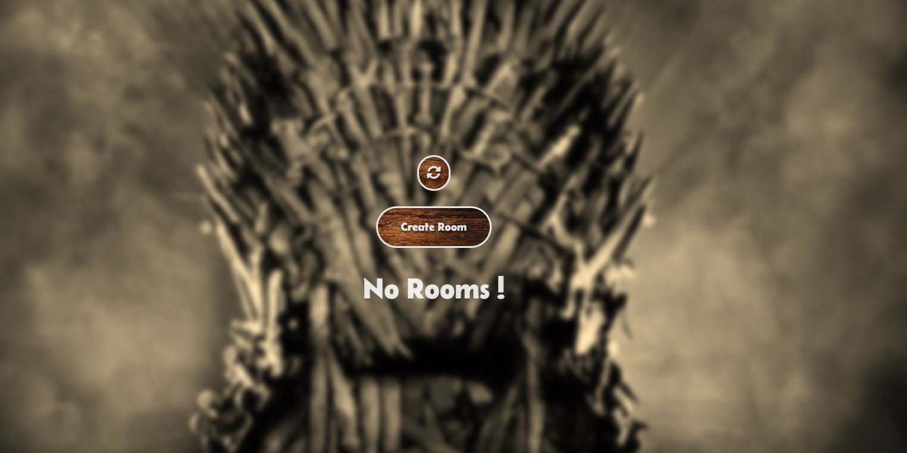

From there you can see all the Rooms created by other players that are waiting a opponent, If you want to enter to a Room click on that.

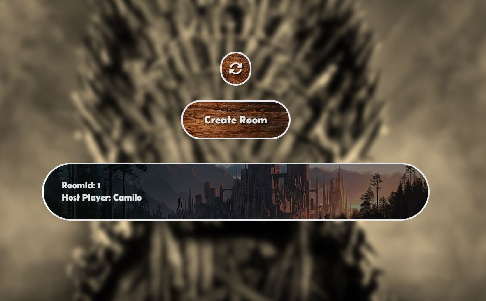

Once you click there will appear a textBox that wait you to enter your name. Enter your name and click the button to confirm. If everything was okay, you gonna pass to the loading screen and the combat starts.

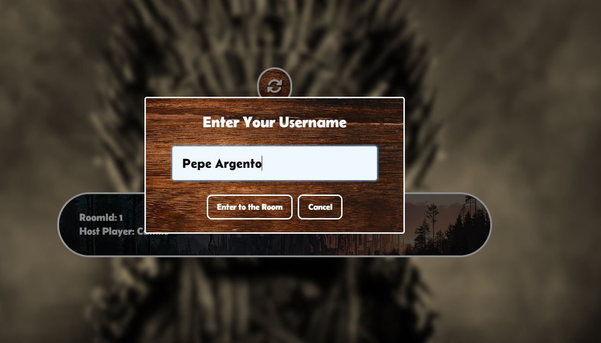
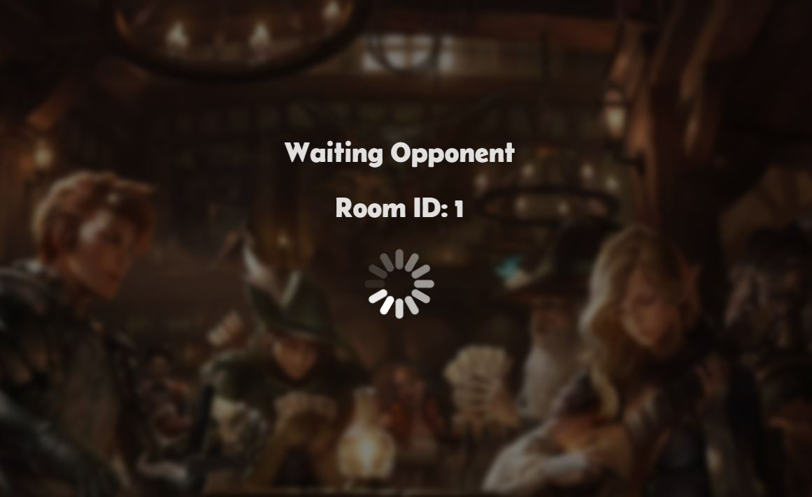
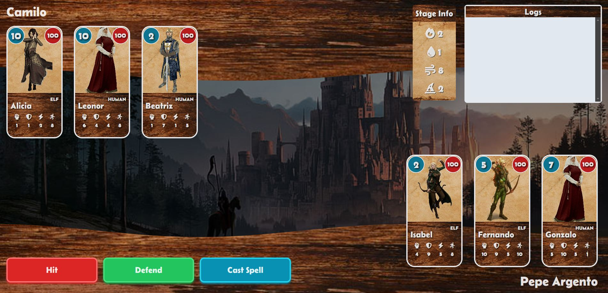
If you want to create a Room, where you will wait until other player to connect, in the home page, click on the "Create Room" Button. You will see the next window.
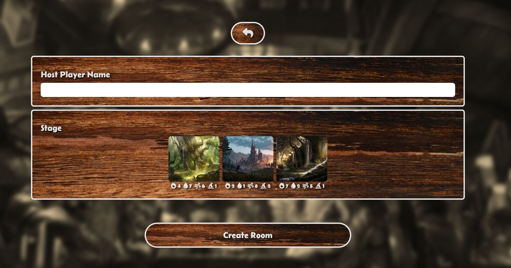
In these window you need to config the stage where you will fight, and your host name. Write your name and select one of the stage below making click on them. Once you have configurated, touch the button below.
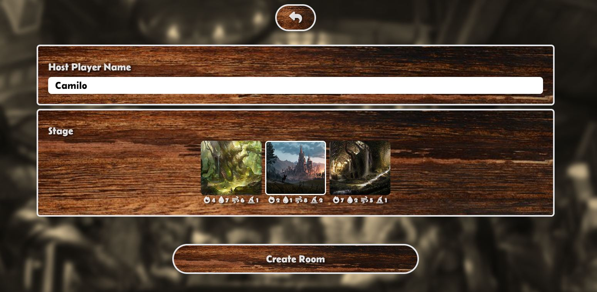
Now you need to wait that other Player connect. You can see the ID of the room that you are.

## How to Play

### System

How i told you before, the game works like a Magic's Game, each card has attributes, so it can be better in some cases and another isn't. It will depend of the others cards and the combat stage. The background also has attributes that can benefits the cards. The combat system is based on the rock, paper and scissors game. That's mean that all the players should select a Card and a movement to make. below you have the movement priorities

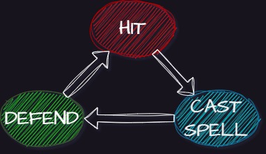

**The damage received will depend of the card attributes, the stage attributes and the movement selected**

The Game will finish when one o both Players lost all their cards

### Races 
We have 3 races of cards:

* The Humans, they are good in the Defends
   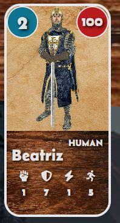 
* The Orcs, they are good in the Hits
   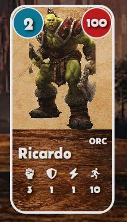 
* And the Elfs, they are good Casting Spells
   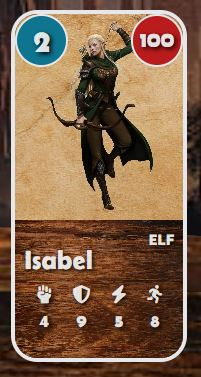 

### Card Info

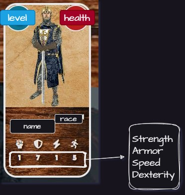 
